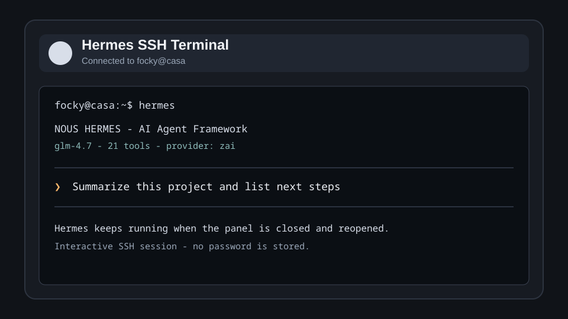

# Hermes SSH Terminal

Run **Hermes Agent** on a remote machine from the Noctalia bar through an interactive SSH terminal.



## Features

- Bar widget with the Hermes Agent icon.
- Interactive SSH session that launches `hermes` on the remote host.
- Terminal-like input for Enter, Backspace, arrow keys, Ctrl+C, Ctrl+D, Ctrl+L, and Tab.
- Panel state survives closing and reopening while the SSH session is active.
- Optional automatic connection on Noctalia startup.
- Passwords are never saved; use SSH keys for unattended startup connections.

## Requirements

- Noctalia Shell >= 4.6.6.
- `python3` and `ssh` on the local machine.
- `hermes` available in `PATH` on the remote host.
- SSH key authentication for `Connect on startup`.

## Installation

Install from Noctalia's plugin browser when available, then:

1. Enable **Hermes SSH Terminal** in Settings -> Plugins.
2. Add the bar widget in Settings -> Bar.
3. Open the widget and configure the SSH host, port, and user.

## Keyboard shortcut

You bind a physical key in your compositor; the plugin handles the toggle. The
chosen key opens and closes the panel, and an active SSH session is focused on
open so you can type immediately.

### IPC bind (works on every compositor — recommended)

The plugin exposes IPC commands (`toggle`, `open`, `close`). Bind a key to call:

```bash
qs -c noctalia-shell ipc call plugin:hermes-ssh-chat toggle
```

**Niri** (`config.kdl`) — add inside your `binds { ... }` block:

```kdl
binds {
    Mod+H { spawn "qs" "-c" "noctalia-shell" "ipc" "call" "plugin:hermes-ssh-chat" "toggle"; }
}
```

**Hyprland** (`hyprland.conf`):

```ini
bind = SUPER, H, exec, qs -c noctalia-shell ipc call plugin:hermes-ssh-chat toggle
```

**Mango**:

```bash
bind=SUPER,H,spawn_shell,noctalia-shell ipc call plugin:hermes-ssh-chat toggle
```

### Hyprland global shortcut (optional — uses the settings field)

Only on Hyprland (needs `hyprland_global_shortcuts_v1`). The plugin registers a
global shortcut named in **Settings -> Plugins -> Hermes SSH Terminal -> Toggle
shortcut name** (default `hermes-toggle`). Bind a key to it:

```ini
bind = SUPER, H, global, noctalia:hermes-toggle
```

Use the same name on both sides. On Niri/Mango this method is inert — use the
IPC bind above.

## Settings

| Setting | Description |
|---|---|
| Default host / IP | Remote machine where `hermes` runs. |
| Default user | SSH user for the remote machine. |
| SSH port | SSH port, default `22`. |
| Panel width / height | Preferred panel dimensions. |
| Terminal columns / rows | PTY size sent to the remote session. |
| Terminal font size | Font size used by the terminal renderer. |
| Connect on startup | Starts the SSH session when Noctalia loads the plugin. |
| Remember last target | Saves the last host, port, and user after connecting. |
| Show text in bar | Shows the Hermes label next to the bar icon. |
| Toggle shortcut name | Hyprland global shortcut id used to open/close the panel (default `hermes-toggle`). |

## Troubleshooting

### The panel connects but Hermes does not open

Run this manually from a terminal and fix any remote shell issues first:

```bash
ssh -tt user@host "TERM=xterm-256color COLORTERM=truecolor hermes"
```

### Connect on startup does not finish

This option does not save passwords. Configure SSH key authentication for the target host.

### The terminal display looks misaligned

Increase the panel width or lower terminal columns in the plugin settings. Hermes uses a TUI and expects enough columns for its status and input lines.

## Credits

The Hermes Agent icon is from [Lobe Icons](https://github.com/lobehub/lobe-icons), licensed MIT.

## License

MIT
