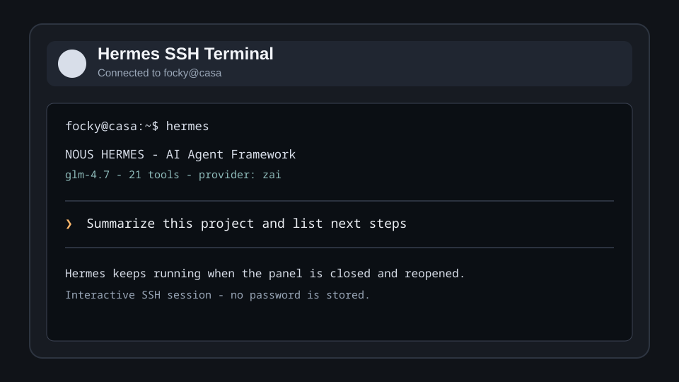

# Hermes SSH Terminal

Launch Hermes Agent on a remote machine from Noctalia 5 through an interactive SSH terminal.



| Plugin | Value |
|---|---|
| ID | `felipemayerdev/hermes-ssh-chat` |
| Bar widget | `remote` |
| Panel | `terminal-panel` |

## Usage

1. Enable `felipemayerdev/hermes-ssh-chat`.
2. Configure the SSH host, port, user, and remote command in plugin settings.
3. Add **Hermes SSH Terminal → remote** to the bar.
4. Click the widget, optionally adjust the target for this launch, then select **Open SSH terminal**.
5. Open the panel directly with:

   ```bash
   noctalia msg panel-toggle felipemayerdev/hermes-ssh-chat:terminal-panel
   ```

Right-click the bar widget to reopen plugin settings.

Noctalia 5 plugin panels are declarative controls rather than embeddable QML terminal surfaces. This port therefore launches the configured system terminal through `noctalia.runInTerminal`; the real terminal owns the PTY, rendering, keyboard handling, host-key confirmation, and password prompt. Credentials are never read or stored by the plugin.

## Requirements

- `ssh` on the local machine
- `hermes` available on the remote host
- A terminal configured in Noctalia

SSH key authentication is recommended. Existing `~/.ssh/config`, agent, known-host, proxy, and control-master settings are honored by the system SSH client.

## Settings

| Setting | Default | Description |
|---|---:|---|
| Host | Empty | Remote hostname or address. |
| Port | `22` | SSH server port. |
| User | Empty | Optional SSH user. |
| Remote command | `hermes` | Interactive remote command. |
| Identity file | Empty | Optional key passed with `ssh -i`. |
| Extra SSH arguments | Empty | Trusted arguments such as `-J bastion`. |
| Show target in bar | On | Shows `user@host` beside the terminal glyph. |

`Extra SSH arguments` is intentionally passed to the shell as command syntax. Only enter values you trust; prefer `~/.ssh/config` for complex connection policy.

## Troubleshooting

Run the equivalent command directly before debugging the plugin:

```bash
ssh -p 22 -t user@host hermes
```

If clicking **Open SSH terminal** reports failure, configure a terminal in Noctalia and verify that terminal launching works elsewhere in the shell.

## Credits

The Hermes Agent icon is from [Lobe Icons](https://github.com/lobehub/lobe-icons), licensed MIT.

## License

MIT — see [LICENSE](LICENSE).
